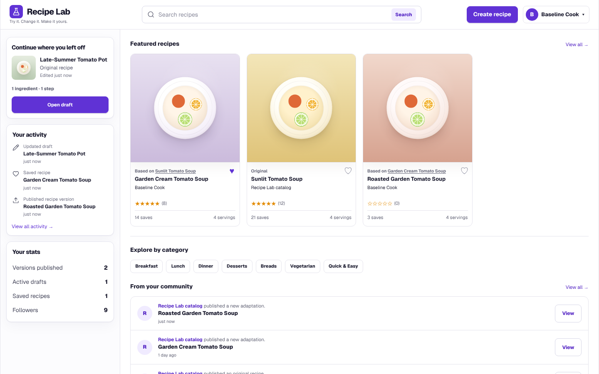
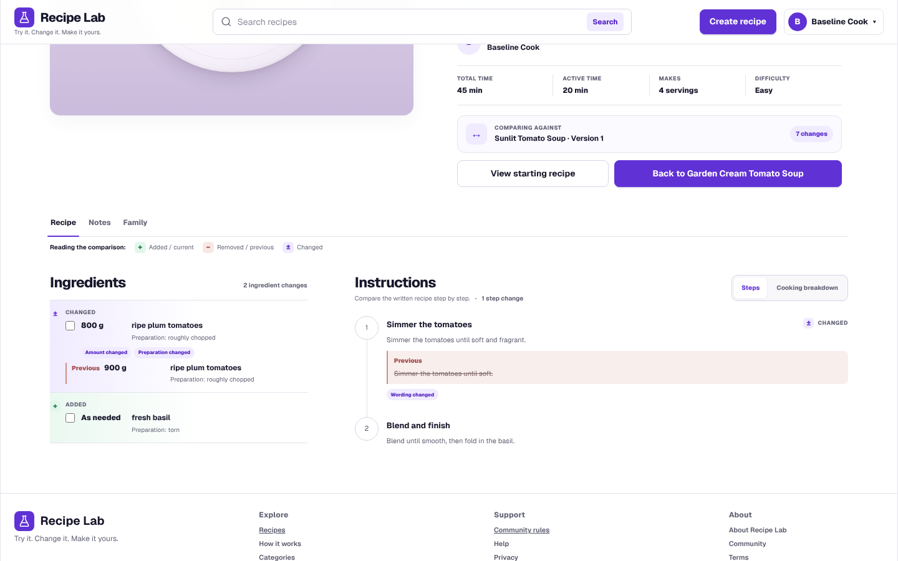

# Recipe Lab

Recipe Lab is a version-controlled cooking platform. Recipes are structured,
published as immutable editions, and connected to the exact edition a cook
adapted. A later correction never rewrites another cook's history.

**Find recipes, make your own version, compare what changed, and follow recipe
history.** Browse and compare anonymously, or sign in to save, rate, publish,
follow cooks, and keep private drafts.



## What to try

The clearest demonstration is a two-cook workflow:

1. One cook publishes a recipe.
2. Another cook makes a version of that exact published edition.
3. The original cook publishes a correction.
4. The adapted recipe still identifies and compares against the edition it
   actually came from.

That flow exercises Recipe Lab's central model: a stable recipe identity can
have multiple immutable editions, while every adaptation preserves exact
lineage. Private drafts remain separate until an explicit publication
transaction succeeds.



The optional portfolio sandbox creates a temporary demo account without an
email address or real name. Its isolated database, backend, and frontend expire
together within 24 hours. Published demo work is public and temporary; the
sandbox is a deployment profile, not a second authentication system. See the
[operations guide](docs/operations.md#portfolio-sandbox) for its boundaries and
startup procedure.

## Engineering highlights

- **Immutable publication.** Publishing materializes one complete snapshot in
  a transaction. Published content is never edited in place.
- **Exact lineage.** Forks point to the edition that was copied, not whichever
  edition happens to be current later.
- **Private work stays private.** Incomplete drafts, optimistic revisions, and
  unresolved ingredient requests cannot leak through public recipe reads.
- **Backend authority.** The API owns authentication, authorization,
  visibility, moderation, account deletion, and publication policy. The UI
  presents those decisions but is not a security boundary.
- **Deliberate frontend ownership.** Feature code owns domain behavior, the app
  layer composes features, the shell stays feature-neutral, and shared code
  remains domain-neutral.
- **Retry-safe writes.** Publication and interaction seams preserve
  idempotency, audit evidence, and transaction ownership.
- **Accessible state and navigation.** Loading, empty, unavailable, denied, and
  retryable failure states remain distinct, with keyboard and focus behavior
  covered by automated checks.

## Stack

| Layer | Technology |
| --- | --- |
| Web | Next.js, React, TypeScript, CSS, Vitest, Playwright |
| API | FastAPI, Pydantic, SQLAlchemy, Alembic, pytest |
| Data | PostgreSQL with database-backed integrity constraints |
| Authentication | OpenID Connect Authorization Code with PKCE; opaque server sessions |
| Research | Python offline evaluation and deterministic recommendation experiments |
| Runtime | Docker Compose for development; locked production image targets |

The browser uses a same-origin Next.js proxy for authenticated API access.
Public server-side reads and authenticated browser traffic intentionally use
different access paths. See [Architecture](docs/architecture.md) for the full
boundary and data-flow explanation.

## Quick start

Requirements: Docker Desktop with Docker Compose.

```powershell
Copy-Item .env.example .env
docker compose build
docker compose up -d db
```

For an existing database, run the fail-closed legacy measurement audit before
migrating. Skip this audit only for a fresh database where the legacy recipe
table does not exist:

```powershell
docker compose run --rm backend recipe-lab-measurements audit-legacy --format json
if ($LASTEXITCODE -ne 0) { throw "Resolve the measurement audit before migrating." }
```

Then migrate, load the reviewed seeds, and start the application:

```powershell
docker compose run --rm backend python -m alembic upgrade head
docker compose run --rm backend python -m app.seeds load
docker compose up -d backend frontend
```

Open the web app at <http://localhost:3000>, API health at
<http://localhost:8000/api/health>, and interactive API documentation at
<http://localhost:8000/docs>. Stop the services with `docker compose down`.
Add `--volumes` only when intentionally discarding local data.

Authentication is disabled until an OIDC provider is configured. The
[development guide](docs/development.md) covers environment setup, direct
service execution, migrations, seeds, and authentication configuration.

## Verification

The repository has one command surface for its stable checks:

```powershell
python scripts/run_quality_gate.py contracts lint types
python scripts/run_quality_gate.py backend frontend ml
```

Database, browser, visual, performance, production-image, and recovery checks
require their documented environments. The [testing guide](docs/testing.md)
explains the evidence each tier provides rather than treating every check as
interchangeable.

### Research preview: offline, not product

Research-preview engineering capabilities, which are not consumer product
surfaces, include a transparent baseline ranker plus deterministic offline
content, collaborative, hybrid, and substitution experiments. They exist to
compare approaches under fixed snapshots and explicit limitations. Synthetic
fixture results are not evidence of real-user recommendation quality, and the
offline models are not served by the normal application.

See the [research workspace](ml/README.md) for the result-first overview and
the [frontend and product-language conventions](docs/frontend.md#product-language)
for the boundary between shipped cook-facing language and research terms.

## Current limitations

- Hosted deployment configuration is not included; operators must supply OIDC,
  HTTPS, secret management, backups, monitoring, and reviewed release policy.
- The public sandbox is intentionally temporary and must not contain personal
  or sensitive information.
- Research models are offline experiments, not personalization claims or a
  production recommendation service.
- Exceptional erasure of already-published content is not implemented as an
  ordinary account or moderation action.

## Documentation

Start with the [documentation index](docs/README.md). Its guides describe the
system that exists now; implementation history remains available in Git and
merged pull requests rather than in a parallel archive of migration diaries.
